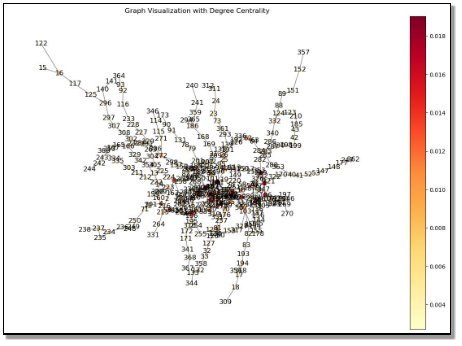



# Abstract
Assessing the efficiency and impact of London's railway network is crucial for understanding its role in Great Britain's economic, social, and financial spheres. This study utilizes data from Transport for London's 2013 records, encompassing DLR, Overground, and Tube categories, to conduct a thorough network analysis. The findings reveal a network characterized by optimization of coverage over redundancy, potentially affecting its resilience to disruptions. Degree Centrality distribution highlights varied connections among nodes, emphasizing the need for congestion management at crucial hubs. Additionally, analysis of Betweenness Centrality identifies pivotal nodes influencing network flow, guiding strategic planning efforts. Furthermore, the study examines the network's modularity, clustering coefficient, and algorithms to identify community structures and potential enhancements. Strategic recommendations focus on enhancing core resilience, optimizing design for efficiency and redundancy, and leveraging localized connectivity to enhance operational resilience. In conclusion, the London transport network demonstrates a balanced design aimed at optimizing coverage, efficiency, and resilience. Insights from this analysis provide a roadmap for targeted enhancements to ensure operational reliability, robustness, and service quality, effectively addressing present and future challenges.

# Introduction
Network analysis of London's rail transportation is vital for assessing efficiency and impact on Great Britain's factors. Economic, social, and financial aspects thrive with a robust transportation network. Data from Transport for London's website, collected in 2013, includes DLR, Overground, and Tube categories. Nodes represent London train stations, and edges signify existing routes. The multiplex network incorporates three layers: aggregated weighted graphs of underground lines, Overground connections, and DLR stations. Raw data and station coordinates are available, along with multiplex networks reflecting real disruptions. Visit https://www.tfl.gov.uk/ for details.

|Layer ID|Layer Name|Layer Colour|Count of Nodes|
| :-: | :-: | :-: | :-: |
|0|DLR|Blue|37|
|1|Overground|Red|99|
|2|Tube|Yellow|343|
|Total|||479|

Ref: Manlio De Domenico, Albert Solé-Ribalta, Sergio Gómez, and Alex Arenas, Navigability of interconnected networks under random failures. PNAS 111, 8351-8356 (2014)

Fig 2.1 Representing 479 nodes categorized as three layers DLR, Overground and Tube

## Analysis

We have found the below insights and literature documents related to the London rail transportation network analysis.

## Literature Review

The London train network is critical to the city's economy, transporting an estimated 1.1 million people daily. Transport for London (TfL) operates the London Underground, Docklands Light Railway (DLR), and Tramlink. The Tube, which spans 402 kilometres and operates 11 lines, handles an amazing 5 million journeys per day. To ensure its seamless operation, a complete network analysis and disruption free networking is required. This includes reviewing its performance, capacity, and areas for improvement. By analysing the network', we would like to inference on the potential efficiency increase, reduce congestion, and meet the evolving demands of London people. 

A study demonstrates the resilience of rail network is influenced by the speed of backup restoration failure in network vulnerability during peak hours increases 63% of increase in passenger delays compared to off- peak hours. While studies have made substantive contributions to research knowledge of the resilience of rail networks, they are limited in their approach to analysing the dynamic knock-on effect of train disruptions on timetabling, train and passenger delays and how these propagate across the interdependent network. Also, these existing studies are limited in their approach to the study of the impact of system-of-systems interdependencies on the resilience of rail networks and their practical application to real-word networks, with a dearth in research literature of robust methodologies and models for resilience assessment of large, complex rail networks at regional and national scale. *Ilalokhoin et al. (2023)*

A study on causes of disruptions is associated with weather condition mainly. Great Britain shows that the train operators apparently have been better able to manage delays with the extreme network conditions. John Preston, Graham Wall, Richard Batley, J. Nicolás Ibáñez,and Jeremy Shires(2019). Also,an analysis shows that assumptions on train path and delays are not accounted for multi train tracks. The model enhance risk analysis for large rail networks like in Great Britain while prioritising the disruptions enhance network resilience. *Ohis Ilalokhoin, Raghav Pant & Jim W. Hall (2022)* 

The reliability of London rail transportation is high, as they are monocentric networks. In general, the London rail network boasts peripheral hub connections, which contribute to its robustness in comparison to the Shanghai and Randstad rail networks. Furthermore, the connectivity of radial networks is highly susceptible to disruption, resulting in the isolation of a single branch from the remaining network. The research study reveals that the correlation between network structure and its resilience is non-trivial *(Cats & Krishnakumari, 2020)*

The London rail transportation networks conduct a thorough assessment of assets based on their failure probability, failure consequences, and associated expenses and inspections. This model introduces a multilayer network infrastructure, simulation of failure propagation dynamics, incorporating network skeletonization to reduce computational complexity. The methodology is adaptable to other infrastructure networks and facilitates the evaluation of mitigation measures. The limitations encompass presumptions regarding the synchronization of failure timescales and rail passenger behavior, which can be addressed in future research, along with the enhancement of model detail and the incorporation of asset recovery dynamics..*Wee et al. (2023)*

A study on the Density and dispersion on London rail network exhibits the relationship between the diverse density population and the dispersed London rail structures as underground and overground shaping the cities in a better way. The network structure helps to reduce the crowd towards the central London, dispersing equally across to maintain the minimal disruption between the passengers. The research also generalises on the invent of new modes developed in the London networks. *Levinson (2008)*

A graph-based approach to model cascading delays in the British railway network, acknowledging the intricate nonlinear interactions inherent in such disruptions. Utilizing the Spatial-Temporal Graph Convolutional Network (STGCN) architecture, predicting delays throughout the network, outperforming traditional statistical models. This method captures both spatial and temporal dimensions, enhancing accuracy in predicting delays for trains traversing each link. Future directions include extensive comparisons with existing models, refining problem formulations to account for specific routes and inbound/outbound traffic, and deeper exploration of delay causes and propagation for real-world deployment of our models. *Heglund et al. (n.d.)*

A recent study provides valuable insight into how to mitigate future heat-related risks and improve the resilience of rail infrastructure to extreme weather events. It addresses a crucial matter pertaining to the vulnerability of rail infrastructure, specifically the London Underground (LU), to extreme weather events, with a particular emphasis on the impact of heat. The study's recommendations encompass the expansion of the analysis to the LU asset scale, incorporating the local environment to comprehend failure causality, and scrutinizing delay capture methodologies to facilitate climate resilience benchmarking among infrastructure networks. *Greenham et al., 2020*

A wide range of research are undertaken in accordance to minimise the disruptions with London rail transportation network. Though the existing rail network seems to be robust when compared to Paris and other European countries, there are significant areas of improvement in handling the disruptions in terms of improvement in association with economic, social and financial and population density aspects.

## Analysis
### Network Density

Network density measures at 0.006333215506068104, indicating a sparse network common in large-scale transportation systems, optimizing coverage over redundancy. This may affect resilience to disruptions but also suggests efficient design.
### Degree Centrality

The Degree Centrality distribution in the London transport network showcases varied connections, with outliers indicating crucial hubs that may require congestion management. The histogram highlights how degree centrality values distribute across nodes, skewing towards lower values typical in real-world networks like transportation systems. This indicates most stations have few direct connections. Despite lower heights, hubs signify key stations, enhancing network efficiency. The overall shape reveals a decentralized structure, with critical hubs ensuring network cohesion and efficient movement. Enhancing these hubs' capacity could significantly boost network performance, while their vulnerability underscores the need for contingency planning. Understanding centrality distribution informs planning efforts, aiming to bolster connectivity for less central nodes and optimize flow through key hubs.

Fig 2.3.2.1 visual representation the number of nodes with degree centrality values distributed across the nodes in the London transport network.

Fig 2.3.2.2 Network visualization - degree centrality on London rail transportation

### Betweenness Centrality

The histogram for betweenness centrality likely displays a right-skewed distribution, typical in networks, indicating most stations have low betweenness centrality, lying on fewer shortest paths. Despite relatively low bars on the right, few stations act as significant connectors, facilitating major flow between others. These critical nodes influence network flow, representing potential bottleneck points affecting efficiency and resilience. Stations with high betweenness centrality are pivotal for connectivity; disruptions here cause delays. Enhancing infrastructure at these stations disproportionately improves network functionality. Analysis of betweenness centrality guides strategic planning, highlighting key nodes for improvement to enhance performance and resilience against disruptions, providing crucial insights into the London transport network's flow dynamics.

Fig 2.3.3.1 Histogram of Betweenness Centrality illustrates how betweenness centrality values are distributed among the nodes within the London transport network.

Fig 2.3.3.2 Network visualization - betweenness centrality on London rail transportation

### Closeness Centrality

Variability across ranges indicates certain stations are more centrally connected. Stations with high closeness centrality are pivotal, ensuring network accessibility and efficiency by facilitating shorter travel times. Enhancing services at these strategic points can significantly improve network performance. Conversely, stations with lower closeness centrality may need improvement to enhance overall accessibility. Analyzing closeness centrality aids in identifying accessible and isolated nodes, guiding planning efforts to improve connectivity and reduce travel times. This perspective offers insights into the network's cohesion and accessibility, guiding targeted improvements for a more user-friendly London transport network.

Fig 2.3.4.1 concentration of closeness centrality values within a specific range, suggesting uniformity in station connections.

Fig 2.3.4.2 Network visualization - closeness centrality on London rail transportation

### K Core

K-Core Nodes count of 221 offers insight into the London transport network's structure. A k-core is a maximal subgraph where each node has at least k connections to others within it, revealing cohesive subgroups and network resilience. With 221 nodes, this k-core represents a highly connected and cohesive subgraph, crucial for network integrity. These nodes likely include major stations or junctions, vital for passenger movement and network flow. While advantageous for resilience, high connectivity may lead to congestion, necessitating capacity enhancements. Targeted improvements within this core can significantly boost network efficiency and reliability. Understanding the k-core aids emergency planning, ensuring strategies to mitigate disruptions. Enhancing connectivity to and from this core enhances network accessibility. Identifying 221 k-core nodes emphasizes their importance in maintaining network cohesion, resilience, and efficiency within the London transport network.

### Connected Components

The London transport network's single connected component indicates complete interconnectivity, allowing travel between any stations without leaving the network, ensuring comprehensive access for passengers. However, this unity poses vulnerability to disruptions if critical nodes fail, lacking isolated components or redundancies. While advantageous for simplifying route planning and resource deployment, it requires strategic improvements to enhance redundancy, reduce travel times, and alleviate congestion. Increasing redundancy in critical areas and focusing on enhancing efficiency at key nodes are crucial for resilience and smooth network operation. Addressing areas with lower connectivity within the single component can improve inclusivity and utility for all users. Overall, recognizing the network's unity lays the groundwork for strategic planning to optimize efficiency, resilience, and accessibility within the London transport system.

### Cliques

Num of Cliques: 405

Max Clique Size: 3

The London transport network comprises 405 cliques, each with a maximum size of 3, providing crucial insights into its structure. These cliques, where every pair is directly connected, highlight efficiency over extensive direct connections. Strategic improvements at these transfer hubs can enhance network performance, emphasizing efficient pathways through key points rather than creating more direct connections.

### Clustering Co-efficient

The clustering coefficient of around 0.029 in London's transport network reveals that neighboring stations often share connections, indicating a lack of tight interconnection into clusters. This design prioritizes system-wide efficient travel over dense clusters, aligning with urban transport needs. However, optimizing opportunities exist, particularly in underserved areas, where increased local clustering could enhance resilience and accessibility. Strategic enhancements, such as additional routes or services, can improve local connectivity and passenger experience, contributing to network resilience. Understanding the clustering coefficient aids in identifying areas for strategic enhancements, enhancing the network's functionality, resilience, and accessibility.

### Modularity

The network's modularity reveals its community structure, identified by a specific algorithm. High modularity signifies strong community divisions, with dense intra-community connections. The data highlights two distinct communities within the transport network, indicating separate regions where stations are densely interconnected. These communities likely reflect geographical regions or functional divisions like commuter zones versus business districts. Understanding these communities aids targeted planning and optimization efforts, allowing for tailored improvements and service adjustments to meet specific regional needs. Inter-community connections are vital for overall network functionality, facilitating efficient travel across regions. Tailoring services within each community and directing infrastructure investments strategically can enhance connectivity and capacity. Emergency planning considers community disruptions' ripple effects on the broader network, ensuring alternative routes and services to maintain functionality. Identifying communities offers insight into internal connectivity and critical interconnections, guiding strategic planning to optimize the London transport system's resilience and functionality for diverse user needs.

### Louvain method – to optimize the modularity

Number of communities detected: 19

Community 1: [2, 3, 92, 93, 116, 215, 216, 224, 225, 227, 228, 229, 233, 263, 264, 304, 305, 331, 364]

Community 2: [4, 5, 6, 71, 72, 221, 234, 235, 236, 237, 238, 248, 249, 250, 301, 328, 345]

Community 3: [7, 8, 9, 19, 20, 30, 37, 38, 39, 60, 61, 109, 110, 179, 181, 184, 295]

Community 5: [0, 1, 10, 11, 12, 36, 58, 59, 65, 66, 74, 75, 76, 77, 106, 108, 111, 112, 113, 149, 150, 156, 217, 218, 219, 220, 251, 269, 270, 289, 290, 291, 323, 324, 326, 347, 348, 352, 353, 360]

Community 7: [13, 14, 15, 16, 117, 122, 125, 140, 141, 165, 166, 167, 230, 232, 242, 243, 244, 253, 296, 297, 300, 302, 307, 308, 329, 342, 354]

Community 8: [17, 18, 82, 83, 84, 103, 128, 129, 153, 193, 194, 254, 255, 309, 317, 318, 327, 355, 356]

Community 9: [21, 22, 168, 169, 186, 240, 241, 262, 294, 359, 365]

The Louvain method identifies 17 communities in London's transport network, revealing its intricate modular structure. This method efficiently uncovers densely interconnected station groups, suggesting geographical or functional correspondence. Variations in community sizes indicate differences in network density, guiding optimization efforts. Understanding each community's dynamics allows tailored strategies to enhance network efficiency and resilience. Recognizing community structures aids emergency planning and improves overall network satisfaction. Leveraging Louvain insights facilitates strategic planning and infrastructure development, enhancing service quality to meet diverse user needs.

Fig 2.3.10.1 Network visualization of community generated through Louvain Method
### Girvan-Newman algorithm – to identify the communities 

The Girvan-Newman algorithm in network science identifies communities by iteratively removing edges with high betweenness centrality, dividing the graph into denser communities guided by the modularity score. Detecting 17 communities within London's transport network suggests significant specialization, potentially representing geographical areas or transport lines. High modularity scores reflect strong community structure, guiding optimization strategies for enhanced connectivity and infrastructure investments. Resilience planning considers community detection to mitigate disruptions, ensuring alternative routes for network functionality. Leveraging Girvan-Newman insights enhances network efficiency and resilience in London's transport.

Fig 2.3.11.1 Modularity Trend based on Iterations

Fig 2.3.11.2 Network visualization of community generated through Girvan-Newman Algorithm

### Strategic Recommendations
#### Enhancing Core and Component Resilience:
Investing in the K-core and significant K-components of the network can enhance its resilience by upgrading infrastructure, boosting service frequency, and deploying advanced monitoring and rapid response systems to maintain critical nodes and paths during different scenarios.
#### Optimizing Design for Redundancy and Efficiency:
Strategically enhancing sparse design with redundancy can mitigate vulnerabilities by creating alternative routes between cliques.
#### Leveraging Localized Connectivity:
Utilizing cliques for localized connectivity and redundancy enhances passenger experience and operational resilience through targeted improvements in these areas.

# Conclusion
The London transport network exhibits a carefully balanced design that optimizes for coverage, efficiency, and, to a certain extent, resilience. The insights from this analysis not only highlight the network's structural strengths and potential vulnerabilities but also offer a roadmap for targeted enhancements. By focusing on strengthening critical nodes and connections, optimizing for both efficiency and redundancy, and leveraging localized connectivity, the network can improve its robustness, operational reliability, and service quality, ensuring it remains well-equipped to meet both current and future challenges.

# References

- https://www.tfl.gov.uk/ for details.
- Ref: Manlio De Domenico, Albert Solé-Ribalta, Sergio Gómez, and Alex Arenas, Navigability of interconnected networks under random failures. PNAS 111, 8351-8356 (2014)
- https://tfl.gov.uk/corporate/about-tfl/what-we-do#:~:text=London%20Underground,-London%20Underground%2C%20better&text=The%20Tube%20handles%20up%20to,trains%20whizzing%20around%20the%20capital.
- Heglund, J. S. W., Taleongpong, P., Hu, S., & Tran, H. T. (n.d.). *Railway Delay Prediction with Spatial-Temporal Graph Convolutional Networks*.
- Ilalokhoin, O., Pant, R., & Hall, J. W. (2023). A model and methodology for resilience assessment of interdependent rail networks – Case study of Great Britain’s rail network. *Reliability Engineering and System Safety*, *229*. https://doi.org/10.1016/j.ress.2022.108895
- Impact of Delays on Passenger,Train Services,Evidence from Great Britain. John Preston, Graham Wall, Richard Batley, J. Nicolás Ibáñez,and Jeremy Shires 2009
- Levinson, D. (2008). Density and dispersion: The co-development of land use and rail in London. *Journal of Economic Geography*, *8*(1), 55–77. https://doi.org/10.1093/jeg/lbm038
- Wee, X. Bin, Herrera, M., Hadjidemetriou, G. M., & Parlikad, A. K. (2023). Simulation and Criticality Assessment of Urban Rail and Interdependent Infrastructure Networks. In *Transportation Research Record* (Vol. 2677, Issue 1, pp. 1181–1196). SAGE Publications Ltd. https://doi.org/10.1177/03611981221103594
- Cats, O., & Krishnakumari, P. (2020). Metropolitan rail network robustness. *Physica A: Statistical Mechanics and Its Applications*, *549*. https://doi.org/10.1016/j.physa.2020.124317
- Heglund, J. S. W., Taleongpong, P., Hu, S., & Tran, H. T. (n.d.). *Railway Delay Prediction with Spatial-Temporal Graph Convolutional Networks*.
- Greenham, S., Ferranti, E., Quinn, A., & Drayson, K. (2020). The impact of high temperatures and extreme heat to delays on the London Underground rail network: An empirical study. *Meteorological Applications*, *27*(3). <https://doi.org/10.1002/met.1910>
